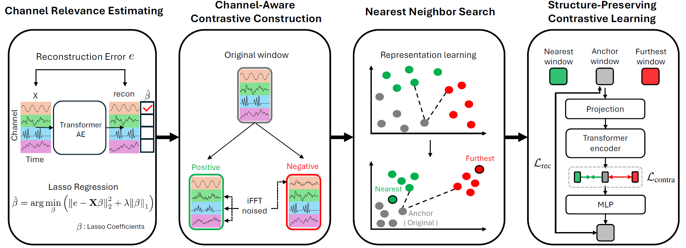
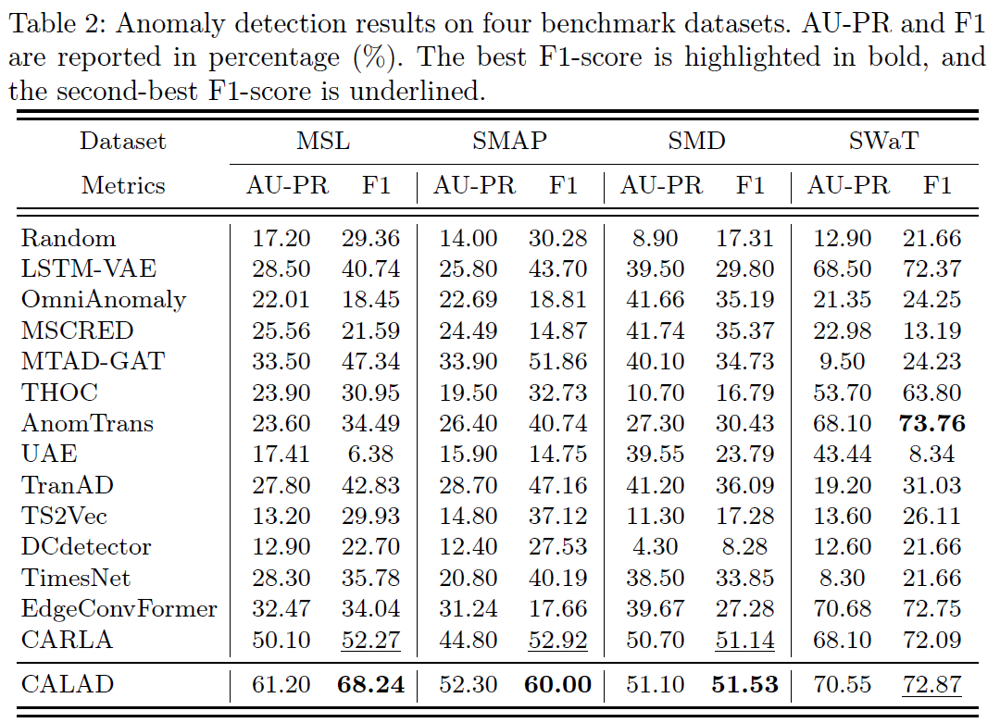

# CALAD: Channel-Aware contrastive Learning for multivariate time series Anomaly Detection

## Abstract

Multivariate time series anomaly detection has become increasingly important in real-world applications, where labeled data are often scarce. Many existing approaches rely on unsupervised learning to model normal patterns, but they often treat all channels equally. This design can dilute anomaly-relevant signals, since not all channels contribute equally to anomaly detection. In this paper, we propose CALAD, a channel-aware contrastive learning framework for multivariate time series anomaly detection. CALAD governs the construction of contrastive samples using estimated channel relevance, allowing the learning process to reflect anomaly semantics rather than generic similarity. Channel relevance is estimated from reconstruction errors of a transformerbased autoencoder and is used to distinguish channels that are more influential to anomalous behaviors. Using this information, we design a channel-wise augmentation strategy in which positive and negative samples are constructed based on whether anomaly-relevant channels are preserved or perturbed. This encourages invariance to changes in irrelevant channels while being sensitive to changes in anomaly-relevant channels. Furthermore, CALAD combines contrastive learning and an auxiliary reconstruction head, allowing the model to learn discriminative representations while retaining normal structures. Experiments on multiple real-world datasets shows that CALAD consistently outperforms existing methods, particularly under distribution shift scenarios.

## Model Architecture



## Get Started

1. Create a virtual environment:

```bash
python -m venv calad
source calad/bin/activate
```

2. Install the required packages:

```bash
pip install -r requirements.txt
```

3. Run (Example: MSL dataset):

```bash
python run.py
```

## Datasets

**Mars Science Laboratory (MSL)** ([source](https://www.kaggle.com/datasets/patrickfleith/nasa-anomaly-detection-dataset-smap-msl))

**Soil Moisture Active Passive (SMAP)** ([source](https://www.kaggle.com/datasets/patrickfleith/nasa-anomaly-detection-dataset-smap-msl))

**Server Machine Dataset (SMD)** ([source](https://github.com/NetManAIOps/OmniAnomaly/tree/master/ServerMachineDataset))

**Secure Water Treatment (SWaT)** ([source](https://itrust.sutd.edu.sg/testbeds/secure-water-treatment-swat/))

## Main Result

